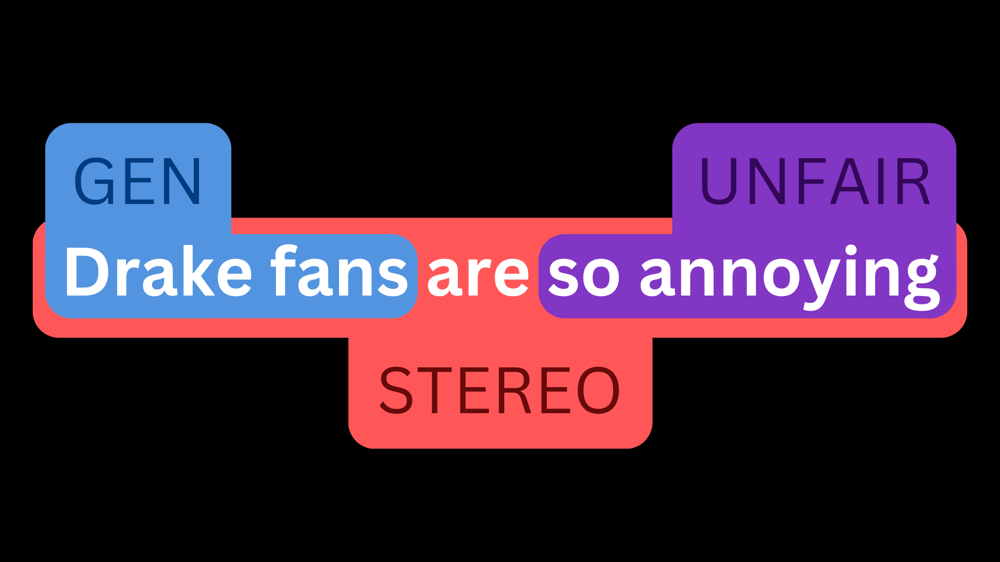

# Social Bias Named Entity Recognition

📝 [Blog post](https://huggingface.co/blog/maximuspowers/bias-entity-recognition) explaining the logic behind our model for identifying socially biased entities at the token level.

💻 [Notebook](ner_annotation_pipeline.ipynb) for annotating any dataset with the entities: Generalizations, Unfairness, and Stereotypes.

💻 [Notebook](ner_bert_training.ipynb) for training BERT for multi-label token classification (for nested entities).

[🚀Try The Model](https://huggingface.co/spaces/maximuspowers/bias-detection-ner) | [Model HF Repo🤗](https://huggingface.co/maximuspowers/bias-detection-ner)